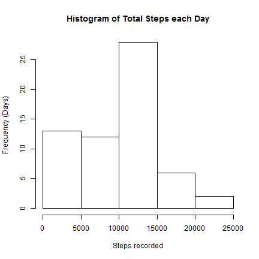
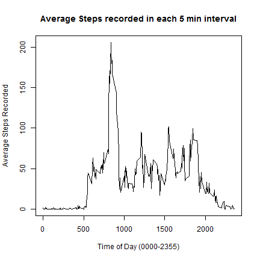
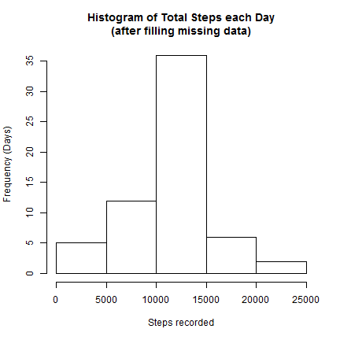
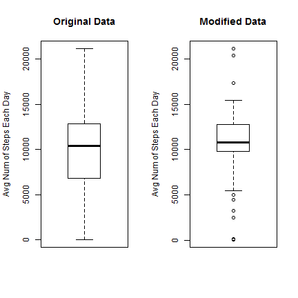
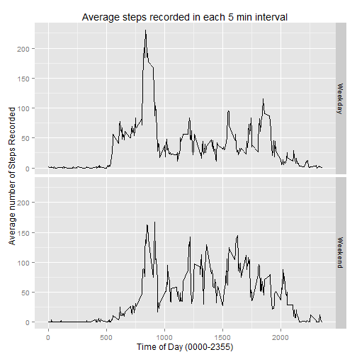

# Module 5 - Reproducible Research - Peer Assessment  1
This assignment makes use of data from a personal activity monitoring device. This device collects data at 5 minute intervals through out the day. The data consists of two months of data from an anonymous individual collected during the months of October and November, 2012 and include the number of steps taken in 5 minute intervals each day.  
  
## Data
The variables included in this dataset are:  
- steps: Number of steps taking in a 5-minute interval (missing values are coded as NA)  
- date: The date on which the measurement was taken in YYYY-MM-DD format  
- interval: Identifier for the 5-minute interval in which measurement was taken  
  
The dataset is stored in a comma-separated-value (CSV) file and there are a total of 17,568 observations in this dataset.  
For this exercise, the CSV file has been downloaded and saved as *activity.csv*.  
  
## Loading and preprocessing the data
We first load the dataset and libraries that will be used.  
*Some information/warnings may be shown when loading the dplyr library, as shown below.*  

```r
data <- read.csv("activity.csv")
library(knitr)
library(ggplot2)
library(dplyr)
```
  
## What is mean total number of steps taken per day?
  
### 1. Calculate the total number of steps taken per day
We sum the number of steps recorded for each day, ignoring NA values.  

```r
stepseachday <- tapply(data$steps,data$date,sum,na.rm=TRUE)
```
  
### 2. Make a histogram of the total number of steps taken each day

```r
hist(stepseachday,main="Histogram of Total Steps each Day",xlab="Steps recorded",ylab="Frequency (Days)")
```

 
  
### 3. Calculate and report the mean and median of the total number of steps taken per day

```r
mean <- mean(stepseachday)
median <- median(stepseachday)
```
The mean number of steps taken each day is: 9354.2295082  
The median number of steps taken each day is: 10395
  
## What is the average daily activity pattern?
  
### 1. Make a time series plot of the 5-minute interval (x-axis) and the average number of steps taken, averaged across all days (y-axis)
We calculate the average number of steps recorded for each interval across all days, ignoring NA values.  

```r
stepseachinterval <- tapply(data$steps,data$interval,mean,na.rm=TRUE)
```
We then plot the resultant data:  

```r
plot(unique(data$interval),stepseachinterval,type="l",main="Average Steps recorded in each 5 min interval",xlab="Time of Day (0000-2355)",ylab="Average Steps Recorded")
```

 
  
### 2. Which 5-minute interval, on average across all the days in the dataset, contains the maximum number of steps?

```r
max <- max(stepseachinterval, na.rm = TRUE)
interval <- names(stepseachinterval)[which(stepseachinterval==max)]
```
The 5-minute interval with the highest average number of steps is recorded at: 835
  
## Inputing missing values
  
### 1. Calculate and report the total number of missing values in the dataset (i.e. the total number of rows with NAs)

```r
badrows <- which(!complete.cases(data))
numofbadrows <- length(badrows)
```
The number of rows with missing values in the dataset: 2304
  
### 2. Devise a strategy for filling in all of the missing values in the dataset. 
For each row with a missing value, we will check which interval it belongs to and assign it the mean previously calculated for that interval.
  
### 3. Create a new dataset that is equal to the original dataset but with the missing data filled in.
We copy the original dataset to a new variable, and execute the strategy above to fill in the missing values.

```r
newdata <- data
for (i in badrows) {
    t <- which(names(stepseachinterval)==newdata[i,"interval"])
    newdata[i,"steps"] <- stepseachinterval[t]
}
```
  
### 4. Make a histogram of the total number of steps taken each day and Calculate and report the mean and median total number of steps taken per day. Do these values differ from the estimates from the first part of the assignment? What is the impact of imputing missing data on the estimates of the total daily number of steps?
We look at the total number of steps each day after filling in the missing data

```r
newstepseachday <- tapply(newdata$steps,newdata$date,sum,na.rm=TRUE)
hist(newstepseachday,main="Histogram of Total Steps each Day\n(after filling missing data)",xlab="Steps recorded",ylab="Frequency (Days)")
```

 
  
And calculate the new mean and median

```r
newmean <- mean(newstepseachday)
newmedian <- median(newstepseachday)
```
Original Mean: 9354.2295082  
New Mean: 1.0766189 &times; 10<sup>4</sup>  
Original Median: 10395  
New Median: 1.0766189 &times; 10<sup>4</sup>  
  
We compare the results before and after filling in the missing data:

```r
par(mfcol=c(1,2))
boxplot(stepseachday,main="Original Data",ylab="Avg Num of Steps Each Day")
boxplot(newstepseachday,main="Modified Data",ylab="Avg Num of Steps Each Day")
```

 
  
## Are there differences in activity patterns between weekdays and weekends?
  
### 1. Create a new factor variable in the dataset with two levels - "weekday" and "weekend" indicating whether a given date is a weekday or weekend day.
We create a new vector containing all the dates of each observation converted into POSIXlt format.  
Then, we use the weekdays() function on it to generate a logical vector indicating the weekends/weekdays.  
Using the logical vector, we convert the dates into either "Weekend" or "Weekday" before binding the result as a new column to our data set.

```r
category <- strptime(newdata$date,"%Y-%m-%d")
t <- weekdays(category)=="Saturday" | weekdays(category)=="Sunday"
category <- as.character(category)
category[t] <- "Weekend"
category[!t] <- "Weekday"
category <- as.factor(category)
newdata <- cbind(newdata,category)
```
  
### 2. Make a panel plot containing a time series plot (i.e. type = "l") of the 5-minute interval (x-axis) and the average number of steps taken, averaged across all weekday days or weekend days (y-axis).
We will recalculate the average steps recorded in each interval across all days, but this time differentiating between weekdays and weekends.

```r
t <- select(newdata,steps,interval,category)
t <- group_by(t,interval,category)
t <- summarise(t,mean=mean(steps))
```
   
And produce the resultant panel plot, showing the difference between Weekdays and Weekends

```r
quickplot(interval,mean,data=t,facets=category~.,geom="line",main="Average steps recorded in each 5 min interval",xlab="Time of Day (0000-2355)",ylab="Average number of Steps Recorded")
```

 
   
It is observed that on **Weekdays**, compared to Weekends, there are generally fewer steps recorded across traditional working hours (0900-1700), apart from the times around 0900 and 1700 itself.  
  
This may suggest that the source of the data was from a person with a desk-bound job and working traditional hours.

# End of Exercise
